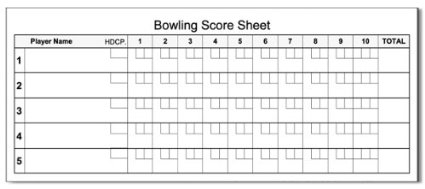

# Kata: bowling-game-spring

## The Kata
This is a relative simple exercise that can be used to practise your skills. 
We try to work according to the TDD principles as much as possible, 
which can be easily practised by simple projects like this one.

## The bowling game
In this kata it is your job to implement the scoring system of a bowling game. We do this by exposing a REST-API.
You need to be able to create a game (endpoint 1) and to the results of your game turn by turm (endpoint 2)

Your main task will be to implement the scoring, taking special results (strike and spare) into account. 
At first we will only implement a single-player game, we can easily extend this to be able to play multiplayer games.

The bowling game consists of 10 frames for each player. In each frame you have a maximum number of rolls. 
In the first 9 frames, you can roll the ball at most 2 times. If you have a strike, your frame is completed after 1 roll.
The last frame has a maximum of 3 rolls. You can throw 3 times if:
- your first 2 rolls are both strikes (all pins are downed at once)
- your second roll results in a spare (all pins are downed with 2 rolls)

## The score

- Every pin counts you hit adds 1 point
- When you roll a spare, the first roll of the next frame is added to the score of the spare-frame
- When you roll a strike, the next 2 rolls are added to the strike-frame
  - 2 rolls of the next frame
  - The roll of the next frame is a strike, and the first roll of the next frame
- The maximum score of a bowling game is 300 points, this is called a perfect game.
  - It consists of 12 strikes (9 for the first 9 frames, 3 in the last frame)

## The setup
- This project uses Spring-Boot, Lombok, Java 17 and Maven to resolve your dependencies.
- Download the project and open it in your preferred IDE. Make sure that all dependencies are resolved
- We've added some integration tests and some record classes that can be used in the project.
  - The integration tests check the end-to-end functionality to ensure that your implementation is correct